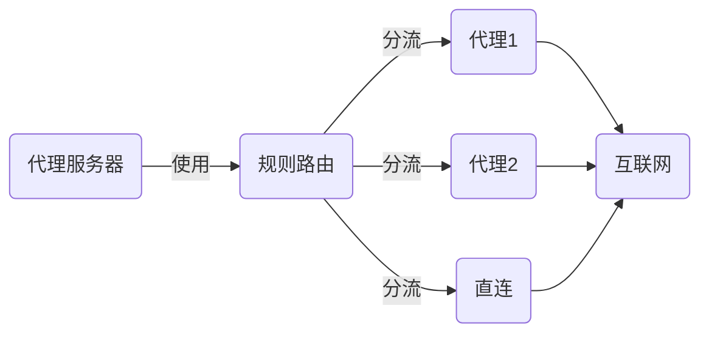

# 基本概念

Rabbit Digger Pro 的配置主要由两部分组成:

- `net`: 虚拟网络层，可以是:

  - 本地网络
  - 代理网络
  - 规则路由
  - 其他特殊类型

- `server`: 代理服务器，支持:
  - HTTP 服务器
  - SOCKS5 服务器
  - 混合模式服务器

## 工作原理

要点:

1. 每个 net 都有唯一的名字和类型
2. 大多数 net 可以链式组合
3. server 可以同时部署多个
4. 支持灵活的规则分流

详细配置示例请参考[配置指南](format)。
